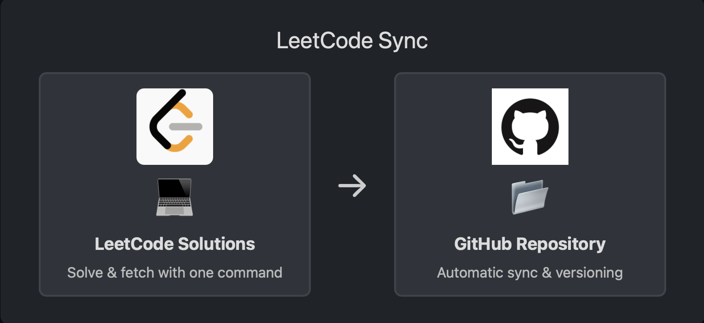

# LeetCode Sync

LeetCode Sync is a tool that allows you to easily fetch your recently accepted LeetCode solutions and store them on a GitHub repository. With a single command, the script retrieves your latest solutions, compares them against previously synced ones, and updates or creates files in your GitHub repository to keep your solutions organized and version-controlled.

This approach ensures you can maintain a clean, centralized backup of your LeetCode solutions while avoiding manual copy-pasting and repeated uploads.



## Key Features

- **Automated Fetching**: Retrieve your latest accepted LeetCode solutions with one command.
- **GitHub Integration**: Push new solutions or updates directly to a GitHub repository of your choice.
- **Version Control**: Keep track of changes over time. If you improve or refactor a solution, it will be updated in the repository.
- **Metadata & Structure**: Each solution is stored in its own folder with a `README.md` and the solution code file.

## Requirements

- **Python 3.x** installed on your machine.
- A [GitHub Personal Access Token (PAT)](https://docs.github.com/en/github/authenticating-to-github/creating-a-personal-access-token) with repo access.
- A valid LeetCode session cookie and CSRF token (retrieved from your browser's developer tools after logging into LeetCode).
- `pip install -r requirements.txt` to install dependencies (e.g., `requests`, `PyGithub`, `python-dotenv`).

## Setup

1. **Clone the Repository**:
```bash
git clone https://github.com/<your_username>/leetcode-sync.git
cd leetcode-sync
```

2. Install Dependencies:
```bash
pip install -r requirements.txt
```

3. Environment Variables:
- Copy .env.example to .env:
```bash
cp .env.example .env
```

- Open .env with a text editor and fill in:
  - LEETCODE_SESSION = your LeetCode session cookie value.
  - LEETCODE_CSRF = your LeetCode CSRF token.
  - GITHUB_TOKEN = your GitHub PAT.
  - LEETCODE_USERNAME = your LeetCode username.
  - REPO_NAME = your GitHub repository name (e.g., username/LeetCode).

Note: Do not commit .env to GitHub as it contains sensitive information.

4. Test Locally:
Run:
```bash
python src/main.py
```

If the setup is correct, the script will:
- Connect to LeetCode and fetch recent accepted solutions.
- Retrieve their code and metadata.
- Check if there are new or updated solutions.
- Commit changes to your GitHub repository if any differences are found.

## How It Works

- The script queries LeetCode's GraphQL API to retrieve recently accepted submissions.
- For each solution, it fetches the code and problem details.
- It then checks a local SQLite database to determine if this particular problem solution has changed since the last sync.
- If new or updated, it creates or updates solution.<ext> and README.md files in a [problem_id]_[problem_slug] folder.
- Finally, it uses the GitHub API (via PyGithub) to commit these changes.

## Updating Your Credentials

If your LeetCode session or token expires, or if you need a new GitHub token, simply update your .env file and rerun the script. The changes will take effect immediately.

## Troubleshooting

- **No Code Found**: If you get "No code found," check that your LeetCode session and CSRF token are still valid. Refresh them and try again.
- **Authentication Errors**: Ensure your GitHub token has sufficient permissions (repo scope).
- **No Changes Synced**: If a solution was already fetched and hasn't changed, it will be skipped.

## License

This project is released under the MIT License.